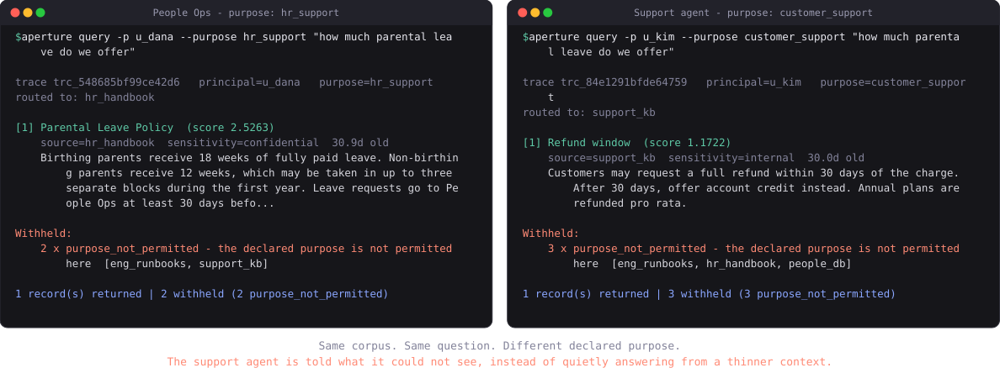

# Aperture

[](https://github.com/Medhovarsh/aperture/actions/workflows/ci.yml)
[](https://www.python.org/downloads/)
[](LICENSE)
[](https://modelcontextprotocol.io)
[](#)
[](https://aperture-eight-bice.vercel.app)

**A governed context plane for AI agents.**

Agents reach enterprise data and enterprise systems through one chokepoint. For
**reads** it knows what the data *means*, who is *permitted* to see it, how *fresh*
it is, and how to *explain a refusal*. For **actions** it measures the blast radius
before anything happens, escalates to a human when policy says so, and records how
to undo what it did.

Runs as an MCP server. Zero paid dependencies, no model API key, no vector database,
no cloud account. It installs inside a locked-down network.

**Live demo: https://aperture-eight-bice.vercel.app** — pick an identity, ask a
question, propose an action, watch the blast radius get priced and the approval get
demanded. All data is synthetic; every visitor gets an isolated session.



*Generated from real CLI output by `python tools/render_demo.py` - the picture cannot
drift away from what the tool actually prints.*

---

## The problem

Every enterprise agent deployment rebuilds the same broken plumbing:

- The vector index has no idea who is asking, so every agent sees every chunk.
- Permission filtering, where it exists at all, is a silent `WHERE` clause. The agent
  never learns that results were withheld, so it answers confidently and wrong.
- Nobody records which data a given answer was built from, so no one can audit or
  reproduce it afterward.
- Source selection is hardcoded, so adding a data source means editing agent code.

BI solved governed access years ago — dbt's semantic layer, Unity Catalog. Agents have
no equivalent. Aperture is that layer.

## The differentiator

**Denial is explainable, never silent.**

Today, an agent that lacks permission just gets fewer chunks and answers anyway.
Aperture returns the records the caller may see *plus* a structured account of what
was withheld and why, and instructs the model to disclose it:

```
1 record(s) returned | 3 withheld (3 purpose_not_permitted)
```

**Purpose binding.** Access is a function of identity *and* declared purpose. The same
person asking the same question under a different purpose gets different data — standard
in privacy law (GDPR purpose limitation), absent from every agent stack.

---

## Quickstart

```bash
pip install -e .
```

```bash
aperture demo --path workspace
```

That builds a small multi-tenant company: HR handbook, engineering runbooks, a support
knowledge base, and an employee database — with real ACLs, classifications, and
freshness SLAs.

### The 30-second demo

Same question. Same corpus. Different declared purpose.

```bash
aperture query -w workspace -p u_dana --purpose hr_support "how much parental leave do we offer"
```

```
trace trc_5cf638c96e10   principal=u_dana   purpose=hr_support
routed to: hr_handbook

[1] Parental Leave Policy  (score 2.5263)
    source=hr_handbook  sensitivity=confidential  30.8d old
    Birthing parents receive 18 weeks of fully paid leave...

Withheld:
    2 x purpose_not_permitted - the declared purpose is not permitted here  [eng_runbooks, support_kb]
```

```bash
aperture query -w workspace -p u_kim --purpose customer_support "how much parental leave do we offer"
```

```
routed to: support_kb

Withheld:
    3 x purpose_not_permitted - the declared purpose is not permitted here  [eng_runbooks, hr_handbook, people_db]
```

The support agent does not silently get a thin answer. It gets told what it could not see.

### Field-level redaction

```bash
aperture query -w workspace -p u_dana --purpose hr_support "Raj Mehta platform engineer manager location"
```

```
[1] Raj Mehta  (score 5.7349)
    source=people_db  sensitivity=restricted  30.0d old
    redacted: national_id, salary
    Raj Mehta Staff Platform Engineer Ana Duarte Bengaluru
```

The row stays useful. Compensation and national ID are removed from the structured
fields *and* scrubbed from the free text, because a salary quoted in a note is still a
leaked salary.

### Audit

```bash
aperture lineage -w workspace tail
aperture explain -w workspace trc_5cf638c96e10
aperture lineage -w workspace verify
```

```
Lineage chain intact across 6 entries.
```

Every query — including every denial — is one hash-chained line in an append-only log:
who asked, under what purpose, which sources were consulted, what came back, what was
withheld and why. Edit any historical line and `verify` names the broken entry.

---

## Connect it to an agent

Aperture speaks MCP over stdio. In `claude_desktop_config.json` (or any MCP client):

```json
{
  "mcpServers": {
    "aperture": {
      "command": "aperture",
      "args": [
        "serve",
        "-w", "/abs/path/to/workspace",
        "-p", "svc_support_agent",
        "--purpose", "customer_support"
      ]
    }
  }
}
```

Tools exposed: `context_search`, `context_fetch`, `catalog_list_sources`, `access_explain`.

---

## Actions: governing what an agent *does*

The same chokepoint, extended past reads. Every agent action is proposed, priced,
and only then executed.

```
propose -> measure blast radius -> policy -> [human approval] -> execute -> undo
```

```bash
aperture actions -w workspace list -p svc_support_agent --purpose customer_support
```

```
support.refund             [financial] reversible
                           Refund a customer, in USD, against their account.
support.close_ticket       [write] reversible
                           Mark a support ticket resolved.
support.message_customer   [external] IRREVERSIBLE, needs approval
                           Send a message to an address outside the company.
```

### Blast radius is measured, not asserted

```bash
aperture actions -w workspace propose ops.purge_region -p u_ops --purpose data_retention --arg region=legacy
```

```
REFUSED: impact_limit_exceeded
  estimated impact exceeds the limit set by policy
  Permanently delete every customer account in region 'legacy' | 7 record(s) affected | 10,320.00 USD | IRREVERSIBLE
```

One short argument, seven deleted accounts. The gap between those two facts is what a
reviewer needs to see, and it comes from a dry run against real state - never from the
agent's own description of what it is about to do.

### Tiered approval

Grants are alternatives, so tiers are expressible. Support refunds up to 100 USD freely;
up to 5000 with a human; nothing above that:

```yaml
- id: support-small-refunds
  effect: allow
  when: {groups: [support], purposes: [customer_support], actions: [support.refund]}
  max_amount: 100

- id: support-large-refunds
  effect: allow
  when: {groups: [support], purposes: [customer_support], actions: [support.refund]}
  max_amount: 5000
  requires_approval: true
```

```bash
aperture actions -w workspace propose support.refund -p svc_support_agent \
  --purpose customer_support --arg customer_id=cus-4471 --arg amount=3000
```

```
proposal prp_087ce0d889ba4838   [pending_approval]
  blast:     Refund 3,000.00 USD to Rivera Logistics | 1 record(s) affected | reversible

  A human must approve this before it can run:
    aperture actions approve prp_087ce0d889ba4838 --as <approver-id>
```

```bash
aperture actions -w workspace approve prp_087ce0d889ba4838 --as u_kim --note "verified duplicate charge"
aperture actions -w workspace execute prp_087ce0d889ba4838 -p svc_support_agent
aperture actions -w workspace rollback exe_a2146dd541694b6b -p u_kim
```

### The four properties that make this a control

**Read access never becomes action authority.** A policy rule that names actions governs
actions only; a rule that does not is invisible to action evaluation. No amount of read
permission adds up to permission to act.

**Approval is not a capability.** It is bound to one proposal, one argument hash, and one
proposer, and it expires. Policy is re-evaluated at execution time, so a permission
revoked between approval and execution stops the action. Approving 3,000 USD and then
executing 90,000 fails with `arguments_changed`.

**Agents never get approve or deny tools.** The MCP surface exposes `action_propose`,
`action_execute`, and `action_status` - never approval. An agent that could approve its
own proposal would make the step decorative. Humans decide out of band. The gateway also
refuses self-approval outright, so a compromised service account holding two identities
gains nothing.

**Reversibility cannot be faked.** The catalog declares whether an action can be undone,
and that claim is verified against the executor at load time. An action that promised an
undo it could not deliver would be the most dangerous entry a catalog could contain, so
the workspace refuses to load.

---

## Running it in production

The demo is honest about being a demo. These are the parts that exist because a
real deployment needs them.

### Executing an approval is an atomic claim

An earlier version of this code lost money in a test. Eight concurrent `execute`
calls on one approved 50 USD refund each passed the state check before any of them
wrote back, and eight refunds were issued:

```
REFUND ROWS WRITTEN: [(1, 50.0), (2, 50.0), ... (8, 50.0)]
TOTAL REFUNDED: 400.0     VERDICT: DOUBLE SPEND
```

State now lives in SQLite, and execution begins with a single conditional UPDATE
that moves a proposal from `ready` to `executing`. Exactly one caller can win it.
The losers are told `proposal_in_flight`. Same treatment for rollback, so two
callers cannot both reverse one refund. `tests/test_concurrency.py` runs the
original attack.

The same test suite caught a second race: appending to the audit log reads the
head hash, chains to it, and writes, and unserialized that let two threads chain
entries to the same predecessor, forking the chain. Appends are now serialized per
file. An audit log that corrupts under concurrent writes is worthless exactly when
it matters most.

**A proposal stranded in `executing` is never retried automatically.** If an
executor dies mid-call, whether the action took effect is unknown, and a machine
cannot safely choose between retrying and giving up. `aperture actions stuck`
surfaces them for a person.

### Budgets, not just limits

Per-call ceilings leave the obvious hole open: a hundred separately-legal 100 USD
refunds are still 10,000 USD, and an agent in a retry loop finds that out faster
than a human does.

```yaml
- id: support-small-refunds
  effect: allow
  when: {groups: [support], purposes: [customer_support], actions: [support.refund]}
  max_amount: 100                # per call
  window_seconds: 3600           # rolling window
  max_amount_per_window: 500     # total across the window
  max_actions_per_window: 5
```

Budgets are re-checked at execution, not only at proposal. A rolled-back action
still consumes budget, because it really did move money twice.

### Identity from a gateway, not a file

A static principals file suits one process serving one identity. When a gateway
fronts many users, something has to carry "this is Kim, acting for customer
support" across a process boundary without letting the agent choose the answer.

```bash
export APERTURE_SIGNING_SECRET=...
aperture assertion -p u_kim --purpose customer_support     # issuer side
aperture serve -w workspace -p unused --signing-secret-env APERTURE_SIGNING_SECRET
```

Assertions are HMAC-SHA256, expire in seconds, and are single use — the `jti` is
recorded, so a captured token cannot be replayed inside its window. **The purpose is
inside the signature**, so a caller that passes `purpose: hr_support` alongside a
token minted for customer support does not get the escalation:

```
first use of token 1                       -> ok
replay of token 1                          -> ERROR assertion_replayed
token 2 + caller tries purpose=hr_support  -> ok, but served as customer_support
```

`AssertionVerifier` is the seam where RS256/JWKS verification drops in. HMAC is what
ships, because it needs no cryptography dependency.

### An audit log you can prove was not rewritten

A hash chain catches edits. It cannot catch someone with write access rewriting the
whole file consistently — recomputation still passes. Checkpoints close that:

```bash
aperture lineage -w workspace checkpoint --secret-env APERTURE_ANCHOR_SECRET
aperture lineage -w workspace verify --secret-env APERTURE_ANCHOR_SECRET
```

```
LINEAGE CHAIN BROKEN (1 problem(s)):
  log has been truncated: checkpoint covers seq 14, which is missing
```

Ship checkpoints somewhere the log's writer cannot reach. Anchoring to a secret that
an attacker with write access can also read proves nothing.

`aperture lineage export` emits newline-delimited JSON, which every SIEM ingests
without a custom parser.

### Serving the playground

Per-visitor session isolation with LRU eviction (a crawler cannot fill the disk one
session at a time), separate rate limits for reads and actions, a content security
policy matching what the page actually loads, and two probes that answer different
questions — `/healthz` says the process is up, `/readyz` says a governed request can
actually be served and the audit chain still verifies.

### Identity from your existing IdP

A static principals file suits one process serving one identity. When a gateway
fronts many users, verify the tokens your organization already issues:

```bash
pip install "aperture-plane[idp]"

aperture serve -w workspace -p unused \
  --jwks-url https://acme.okta.example/oauth2/default/v1/keys \
  --issuer https://acme.okta.example/oauth2/default \
  --audience aperture
```

Works with Okta, Entra, Auth0, Keycloak, or anything else publishing a JWKS
endpoint. Issuer and audience are verified, keys are cached and refetched on an
unknown `kid`, and tokens are single use when they carry a `jti`.

**The algorithm is fixed by policy and never read from the token.** Honouring a
token's own `alg` is the JWT confusion attack — flip it to `HS256` and sign with
the public key as if it were a shared secret. `tests/test_jwks.py` performs that
exact forgery and asserts it fails.

### Actions against real systems

`HttpExecutor` calls an external service for the three phases, which is the shape
of every real integration:

```yaml
- id: ops.refund
  executor: http
  effect_class: financial
  reversible: true
  config:
    estimate_url: https://ops.internal.example/refunds/estimate
    execute_url: https://ops.internal.example/refunds
    compensate_url: https://ops.internal.example/refunds/reverse
    auth_env: OPS_API_TOKEN        # named here, never written here
    timeout_seconds: 10
```

Standard library only. Redirects are refused — a 302 is how an SSRF turns one
allowlisted URL into an arbitrary one, and the test points the redirect at the
cloud metadata endpoint to prove it. Plaintext HTTP to a non-local host is
refused. An action declared reversible that returns no compensation record fails
loudly, because the approval screen already promised an undo.

### Operations

```
GET /healthz    liveness  - the process is up
GET /readyz     readiness - a governed request can be served, chain verifies
GET /metrics    Prometheus text
```

Logs are JSON on stderr with reason codes as queryable fields:

```json
{"ts":"2026-09-03T19:42:24.369Z","level":"info","event":"context.search",
 "purpose":"customer_support","returned":1,
 "withheld":[{"reason":"purpose_not_permitted","count":3}],"duration_ms":20.53}
```

Retrieved content, action arguments, and assertion tokens are **dropped from logs
entirely**, not truncated — the start of a document is usually the part that
identifies it. Metric labels come only from purposes, action ids, and reason codes,
never from user input, so nobody can inflate cardinality until the metrics store
falls over.

### Containers

```bash
docker compose up --build      # playground on :8000
```

Non-root, multi-stage, workspace mounted as a volume so a policy fix does not need
a rebuild. CI builds the image, asserts it is not running as root, and proves both
the HTTP surface and the MCP stdio server work inside it.

---

## For security and compliance reviewers

- **[Threat model](docs/THREAT_MODEL.md)** — trust boundaries, five adversaries,
  26 attacks each mapped to the test that covers it, and the residual risk.
- **[Control mapping](docs/COMPLIANCE.md)** — EU AI Act Articles 10/12/14, GDPR,
  NIST AI RMF, ISO 42001, SOC 2. Written to state what it does *not* cover as
  plainly as what it does. It is a map to evidence, not a compliance claim.
- **[Security policy](SECURITY.md)** — the eleven properties whose violation counts
  as a vulnerability, and how to report one.

---

## Try it in a browser

A hosted playground ships in the repo, covering both halves of the plane.

**Reads:** pick an identity, pick a purpose, ask a question, and watch records appear and
disappear with their reason codes.

**Actions:** propose a refund and see the blast radius priced before anything happens.
Under 100 USD it runs; at 3,000 it waits for a named human; at 9,000 it is refused.
Approve it, execute it, undo it, and watch the operations tables change underneath.
Try purging region `legacy` as the platform lead: one short argument, seven accounts.

Both share one audit trail, and the chain integrity check is on the page.

```bash
pip install -e ".[web]"
uvicorn aperture.playground:app --reload
```

Deploy it anywhere that runs a Python function. For Vercel:

```bash
vercel deploy --prod
```

`vercel.json` and `api/index.py` are already wired; the whole app is one function.

Two things that bit during the first deploy, documented so they do not bite again:
Vercel's Python builder uses `uv` with `pyproject.toml` and ignores `requirements.txt`,
so the function came up without FastAPI (an optional extra there) until `installCommand`
forced pip. And a catch-all rewrite to `/api/index` rewrites the path the app receives,
turning `/healthz` into a 404 — the FastAPI preset already routes every path to the ASGI
app, so no rewrite is needed.

The playground deliberately does the two things the real deployment refuses to do: it
lets **you** choose which principal to act as, and it exposes approval over HTTP. That
is the point of a demo, and it is exactly why the MCP server does neither - identity is
pinned server-side and there is no approval tool at all, because anything a caller can
choose, a prompt injection can choose too. All playground data is synthetic, and on a serverless host the
audit log lives only for the life of the instance.

**The identity is on the server, not in the tool call.** One server instance acts as
exactly one principal. An agent cannot choose who it is, because anything an agent can
put in a tool argument, a prompt injection can put there too. `--allow-principal-override`
exists for local development and says so loudly.

---

## How it works

```
agent (MCP client)
   |
   v  context_search(question, purpose)
[ policy engine ]   principal + purpose -> eligible sources          fail closed
   |
   v
[ semantic router ] question vs source descriptions -> which to query
   |
   v
[ brokers ]         docs | sql | vector      unregistered source = invisible
   |
   v
[ enforcement ]     tenant -> ACL -> clearance -> policy -> freshness
                    -> redaction -> budget      every drop has a reason code
   |
   v
[ lineage ]         hash-chained append-only log
   |
   v
records + provenance + withheld_summary + trace_id
```

Actions run the same shape, with a measurement step and a human in the middle:

```
agent (MCP client)
   |
   v  action_propose(action_id, arguments, purpose)
[ action catalog ]  unregistered action = cannot be proposed
   |
   v
[ executor.estimate ] dry run against real state -> blast radius
   |
   v
[ policy ]          action rules only; grants are alternatives    fail closed
   |
   v
[ approval ]        human decides out of band; bound to arguments; expires
   |
   v
[ executor.execute ] -> result + compensation record
   |
   v
[ lineage ]         same hash chain as reads
```

### Configuration

A workspace is three YAML documents and the data they point at.

**`catalog.yaml`** — the only namespace agents can reach. The `description` is
load-bearing: the router matches questions against it.

```yaml
sources:
  - id: hr_handbook
    kind: docs
    title: HR Handbook
    description: >-
      Employee handbook and people policies: parental leave, paid time off,
      expenses, remote work, performance review cycles.
    owner: people-ops@acme.example
    sensitivity: confidential
    freshness_sla_days: 400
    allowed_purposes: [hr_support, security_audit]
    config:
      path: data/hr
```

**`policy.yaml`** — default deny, deny overrides allow, redactions accumulate.

```yaml
purposes: [hr_support, engineering_oncall, customer_support, security_audit]

defaults:
  stale_action: tag        # or "drop"

rules:
  - id: employees-read-internal
    effect: allow
    when:
      groups: [employees]
      tenants: [acme]
      sensitivity_at_most: internal

  - id: hr-reads-directory
    effect: allow
    when:
      groups: [hr]
      purposes: [hr_support]
      sources: [people_db]

  - id: redact-compensation
    effect: redact
    when:
      sources: [people_db]
    redact_fields: [salary, national_id]

  - id: deny-partners-confidential
    effect: deny
    when:
      groups: [partners]
      sensitivity_at_least: confidential
```

**`principals.yaml`** — identities, groups, clearance, tenant.

`aperture lint` validates all three and refuses a policy that references a source that
does not exist. An unparseable policy stops the server; it never degrades into an open one.

### Connectors

| kind | backing store | notes |
|---|---|---|
| `docs` | Markdown directory | governance metadata in YAML frontmatter |
| `sql` | SQLite | every column reaches enforcement, so redaction is field-precise |
| `vector` | JSONL chunk store | cosine when embeddings are present, BM25 otherwise — and it says which |

Adding a connector means implementing one `search` method. Brokers do no
authorization at all; that separation is what keeps the security surface small.

---

## Security model

Enforced today:

- **Default deny.** No matching allow rule means no access.
- **Fail closed.** A crash inside policy evaluation returns deny, never an exception
  and never an allow.
- **Missing metadata is restrictive.** A record with no ACL is withheld, not shared.
- **Identity is server-side.** Prompt text and tool arguments cannot influence it.
- **Path confinement.** A catalog entry cannot read outside the workspace.
- **SQL identifiers come from the catalog** and are validated against the live schema.
- **Record ids are not capabilities.** Permissions are re-evaluated on every fetch.
- **Tenant isolation** is the first gate and is unconditional.
- **Action authority is separate from read authority**, and impact limits are
  evaluated against a measured blast radius rather than the agent's claim.
- **Executing an approval is atomic.** Concurrent callers cannot both act on one
  approval, and a failed execution is parked for a human rather than retried.
- **Aggregate spend and rate ceilings** bound what a compromised or looping agent
  can do in total, not merely per call.
- **Caller assertions are signed, short-lived, and single use**, with the purpose
  inside the signature.
- **Executor faults become reason codes**, never propagating exceptions.

The red-team suite (`tests/test_redteam.py`) probes each of these, including a poisoned
document that instructs the system to override policy, an agent trying to approve its
own action, and an approved proposal executed with swapped arguments. It is retrieved as ordinary text
and changes nothing, because authorization is computed from the principal and the policy
and nothing an attacker can write into an index participates in that decision.

### What is *not* claimed

- **Single host, not distributed.** SQLite in WAL mode makes execution atomic across
  threads and processes on one machine. Several machines sharing one workspace need
  Postgres behind the same `ActionStore` interface; that has not been built.
- **Executors are demo implementations.** They operate on a local SQLite database.
  The `Executor` interface is the seam for Stripe or Zendesk, and the exception
  boundary already treats executors as untrusted, but no real integration ships.
- **Assertions are HMAC, not public-key.** Issuer and verifier share a secret. An
  RS256/JWKS verifier fits behind `AssertionVerifier` without touching anything else.
  There is no SCIM or directory sync: principals still come from a file.
- **Checkpoints must be shipped off-box to mean anything.** Aperture writes and
  verifies them; getting them somewhere the log's writer cannot reach is deployment
  work this repo does not do for you.
- **Retrieval is lexical BM25.** Deliberate — it makes the plane installable with no
  model download. Swap in a real embedding index without touching any other module.
- **No web dashboard.** `aperture explain`, `aperture lineage`, and `aperture actions
  stuck` cover the operator loop.

---

## Development

```bash
pip install -e ".[dev]"
python -m pytest -q
```

249 tests, run on Python 3.10-3.13 plus Windows and macOS by CI. The two that matter most:

- **`tests/test_conformance.py`** — a policy conformance matrix asserting, for every
  (principal, purpose) pair, exactly which sources are readable. Read it as the
  specification of who can see what. A policy edit that widens access fails here rather
  than in production.
- **`tests/test_redteam.py`** — authorization bypass, identity spoofing, purpose
  escalation, namespace escape, and capability replay, each written as an attack.

## Roadmap

- v2: tool-call governance on the same chokepoint — blast-radius estimation, approval
  escalation for irreversible actions, rollback
- IdP-backed principal registry (SCIM / Okta / Entra) with revocation propagation
- Pluggable embedding index behind the existing broker interface
- External anchoring for the lineage head hash

## License

Apache-2.0
